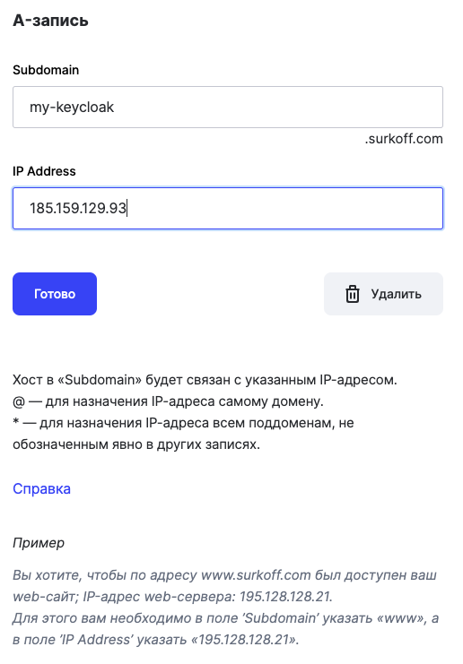
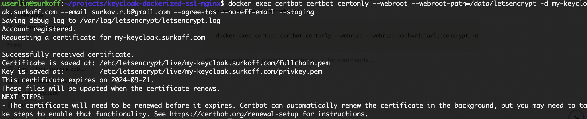
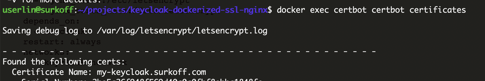
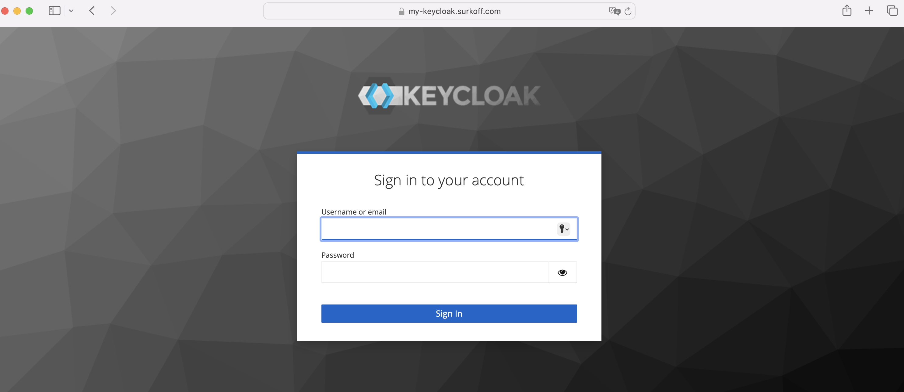

# keycloak-dockerized-ssl-nginx [EN](README.md) / [RU](README_RU.md)
All in one solution for deploying Keycloak on VPS using Docker-compose, Nginx, Certbot and SSL.

### Basic moments:
- Keycloak v.25.0.1
- SSL protection for Keycloak
- Certbot v.2.11.0 for obtaining and updating SSL certificates
- Nginx v.1.27.0 as reverse proxy
- Postgres v.14 for use instead of the standard internal H2 Keycloak database
- Automatic import of realms during deployment
- docker-compose to automate deployment
- .env file for managing system environment variables

## Usage:
### Clone this repository to your VPS server
```git clone git@github.com:s-rb/keycloak-dockerized-ssl-nginx.git```

### Go to cloned folder
`cd keycloak-dockerized-ssl-nginx`

### Edit the file with .env variables (change passwords to your own):
- `KEYCLOAK_ADMIN_PASSWORD` - admin password for access to Keycloak,
- `KC_DB_PASSWORD` - Password for accessing the keylock service to the Postgres database (must be equal to POSTGRES_PASSWORD if a separate user has not been created),
- `POSTGRES_PASSWORD` - admin password for Postgres
-
### Further in the instructions we assume that you will have your own domain `surkoff.com` registered and we want Keycloak to be available at `my-keycloak.surkoff.com`

### You can create your own domain (depending on your registrar), for example, at [REG.RU - register a domain](https://www.reg.ru/domain/new/?rlink=reflink-12623795).
You can use the discount promo code - `925E-FC4C-1D6E-77FE`



### After registering a domain, create an `A` record for the subdomain so that DNS providers know that `my-keycloak.surkoff.com` points to the IP address `192.192.192.192`

### You can check by pinging
```ping my-keycloak.surkoff.com```

In the response we should see a ping to the IP address `192.192.192.192` specified when creating the record.

### In the nginx configs - [default.conf_with_ssl](nginx%2Fconf.d%2Fdefault.conf_with_ssl), [default.conf_without_ssl](nginx%2Fconf.d%2Fdefault.conf_without_ssl) we indicate our domain:
- in the `server_name` section
- in the path to the certificate `ssl_certificate`
- in the path to the key `ssl_certificate_key`

### First we get a test certificate, then a real certificate. We use the config [default.conf_without_ssl](nginx%2Fconf.d%2Fdefault.conf_without_ssl)
`cp nginx/conf.d/default.conf_without_ssl nginx/conf.d/default.conf`

### Running everything using docker-compose
`docker-compose up -d`

### We receive a test certificate (we replace the domain with ours in the command, as well as the email with ours)
```
docker exec certbot certbot certonly --webroot --webroot-path=/data/letsencrypt -d my-keycloak.surkoff.com --email your_email@gmail.com --agree-tos --no-eff-email --staging
```



### Checking the presence of a certificate
`docker exec certbot certbot certificates`



### Removing a test certificate (replace the domain with your own)
`docker exec certbot certbot delete --cert-name my-keycloak.surkoff.com`

### We get a real certificate (replace the domain with your own)
```
docker exec certbot certbot certonly --webroot --webroot-path=/data/letsencrypt -d my-keycloak.surkoff.com --email surkov.r.b@gmail.com --agree-tos --no-eff-email
```

### Change the nginx config to use SSL and restart
```
docker-compose down
cp nginx/conf.d/default.conf_with_ssl nginx/conf.d/default.conf
docker-compose up -d
```

### Checking access to our Keycloak - go to `my-keycloak.surkoff.com` in the browser


### Automatic certificate renewal

To automatically update certificates and restart Nginx, create the `renew_and_reload.sh` script:

```
#!/bin/bash

# Updating certificates
docker exec certbot certbot renew --webroot --webroot-path=/data/letsencrypt

# Restart Nginx
docker restart nginx
```

Making the script executable:

```
chmod +x renew_and_reload.sh
```

Add it to crontab for regular execution:

```
crontab -e
```

Add a line to crontab, not forgetting to specify the path to the script:

```
0 0 1 * * /path/to/renew_and_reload.sh
```