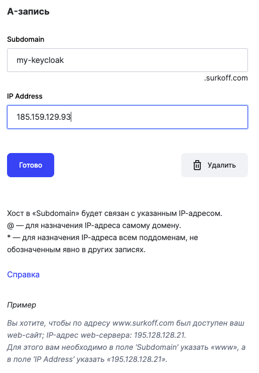
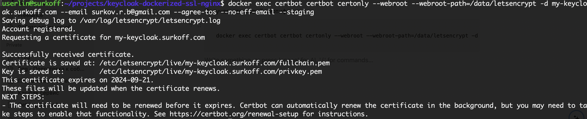

# keycloak-dockerized-ssl-nginx [EN](README.md) / [RU](README_RU.md)
## Комплексное решение для развертывания Keycloak на VPS с использованием Docker-compose, Nginx, Certbot и SSL.
### Основные моменты:
- Keycloak v.25.0.1
- SSL защита для Keycloak
- Certbot v.2.11.0 для получения и обновления сертификатов SSL
- Nginx v.1.27.0 в качестве reverse proxy
- Postgres v.14 для использования вместо стандартной внутренней H2 БД Keycloak
- Автоматический импорт рилмов во время деплоя
- docker-compose для автоматизации деплоя
- .env файл для управления переменными системного окружения

## Использование:
### Клонировать данный репозиторий на свой VPS сервер
```git clone git@github.com:s-rb/keycloak-dockerized-ssl-nginx.git```

### Перейти в клонированную папку
`cd keycloak-dockerized-ssl-nginx`

### Отредактировать файл с переменными .env (изменить пароли на свои):
- `KEYCLOAK_ADMIN_PASSWORD` - пароль админа для доступа в Keycloak,
- `KC_DB_PASSWORD` - Пароль для доступа сервиса кейклоак в БД Postgres (должен быть равен POSTGRES_PASSWORD если не создан отдельный пользователь),
- `POSTGRES_PASSWORD` - пароль админа для Postgres

### Далее в инструкции полагаем что у вас будет зарегистрирован свой домен `surkoff.com` и мы хотим чтобы Keycloak был бы доступен по `my-keycloak.surkoff.com`

### Завести свой домен (зависит от вашего регистратора) например можно у [REG.RU - зарегистрировать домен](https://www.reg.ru/domain/new/?rlink=reflink-12623795).
Можете воспользоваться скидочным промокодом - `925E-FC4C-1D6E-77FE`



### После регистрации домена, создать запись `A` для поддомена чтобы DNS провайдеры знали что `my-keycloak.surkoff.com` указывает на IP адрес `192.192.192.192`

### Проверить можно выполнив пинг
```ping my-keycloak.surkoff.com```

В ответе мы должны увидеть пинг до указанного при создании записи IP адреса `192.192.192.192`

### В конфигах nginx - [default.conf_with_ssl](nginx%2Fconf.d%2Fdefault.conf_with_ssl), [default.conf_without_ssl](nginx%2Fconf.d%2Fdefault.conf_without_ssl) указываем свой домен:
- в секции `server_name`
- в пути к сертификату `ssl_certificate`
- в пути к ключу `ssl_certificate_key`

### Сначала получаем тестовый сертификат, затем реальный сертификат. Используем конфиг [default.conf_without_ssl](nginx%2Fconf.d%2Fdefault.conf_without_ssl)
`cp nginx/conf.d/default.conf_without_ssl nginx/conf.d/default.conf`

### Запускаем все с помощью docker-compose
`docker-compose up -d`

### Получаем тестовый сертификат (заменяем в команде домен на свой, а также почту на свою)
```
docker exec certbot certbot certonly --webroot --webroot-path=/data/letsencrypt -d my-keycloak.surkoff.com --email your_email@gmail.com --agree-tos --no-eff-email --staging
```



### Проверяем наличие сертификата
`docker exec certbot certbot certificates`


### Удаление тестового сертификата (заменить домен на свой)
`docker exec certbot certbot delete --cert-name my-keycloak.surkoff.com`

### Получаем реальный сертификат (заменить домен на свой)
```
docker exec certbot certbot certonly --webroot --webroot-path=/data/letsencrypt -d my-keycloak.surkoff.com --email surkov.r.b@gmail.com --agree-tos --no-eff-email
```

### Меняем конфиг nginx на использующий SSL и делаем перезапуск
```
docker-compose down
cp nginx/conf.d/default.conf_with_ssl nginx/conf.d/default.conf
docker-compose up -d
```

### Проверяем доступ к нашему Keycloak - заходим в браузере на `my-keycloak.surkoff.com`


### Автоматическое обновление сертификатов

Чтобы автоматически обновлять сертификаты и перезапускать Nginx, создаем скрипт `renew_and_reload.sh`:

```
#!/bin/bash

# Обновление сертификатов
docker exec certbot certbot renew --webroot --webroot-path=/data/letsencrypt

# Перезапуск Nginx
docker restart nginx
```

Делаем скрипт исполняемым:

```
chmod +x renew_and_reload.sh
```

Добавляем его в crontab для регулярного выполнения:

```
crontab -e
```

Добавляем строку в crontab, не забывая указать путь к скрипту:

```
0 0 1 * * /path/to/renew_and_reload.sh
```